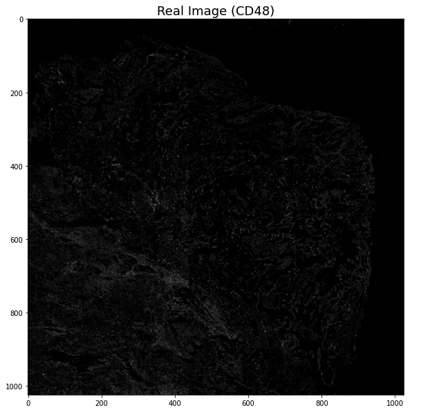
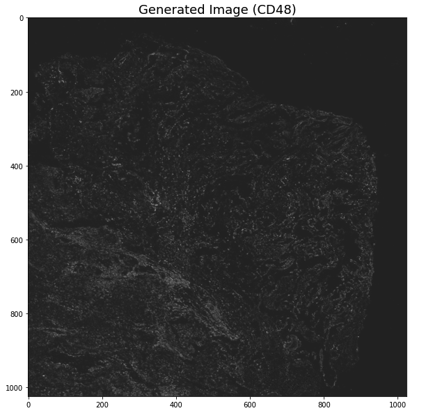
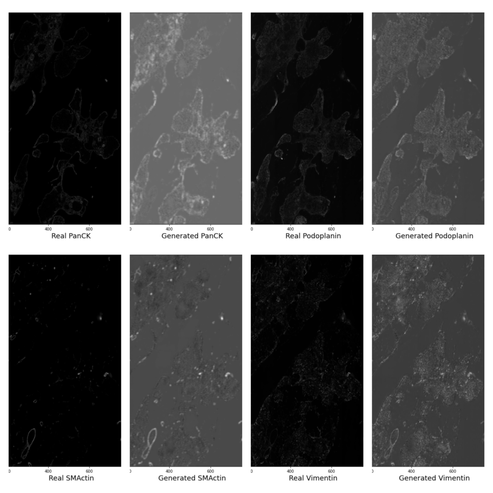

# A SSIM Guided cGAN Architecture For Clinically Driven Generative Image Synthesis of Multiplexed Spatial Proteomics Channels


## Environments
This code has been tested on Ubuntu 20.04 with a Nvidia GeForce A100-SXM-80GB GPU, CUDA Version 11.0, Python 3.8, and PyTorch 1.13.0

## Prerequisites
Linux or macOS
Python 3
NVIDIA GPU + CUDA cuDNN

First you have to clone the repository and install the required libraries using the following commands (GPU required).
```sh
git clone https://github.com/aauthors131/NeurIPS_2022
```
Install the other required libraries
```sh
pip install -r requirements.txt
```
## Selecting Source and Target Channel based on SSIM
Use the below script to get source and target input channel based on SSIM for optimized training.

```sh
python3 select_channel_from_cluster.py --data_dir Data/ \ --channel_names channel_names.txt --num_of_cluster 6 \ --percentage_from_each_cluster 0.8
```
You can also mannualy create the required json file like below for training.
```sh
channel_id_for_training = {"uid": "1", "source_channel_ids": [1,2,3,4,5], "target_channel_ids": [6, 7]}
```
## Training
```sh
python3 train.py \
--raw_data_dir "Data/" \
--tb_logger_name "tb_logger" --dataset_name "codex" \
--channel_ids "channel_id_distribution/cids.json"
```

Some important parameters for network configuration are listed below.

|               |                                                            |
|---------------|------------------------------------------------------------|
| –n_gf         | the number of channels in the first layer of G             |
| –n_downsample | how many times you want to downsample input data in G      |
| –n_residual   | the number of residual blocks in G                         |
| –n_D          | how many discriminators in differet scales you want to use |


Running this script will begin training a model and attempt to generate the target channels of a given
tiff image based on the source channels. It will save the two best models based on validation loss.
The tensorboard will save related plots.

## Testing and Inference.
To test the pretrained model on a dataset use the test.py script.
```sh
python3 test.py --raw_data_dir "Data/"
--trained_model_dir "checkpoints/test/Model/epoch=1699-step=3400.ckpt" \ --channel_ids "channel_id_distribution/cids.json"
```

To use this model for inference, use the infer.py script.
```sh
python infer.py --trained_model_dir checkpoints/test/Model/epoch=1699-step=3400.ckpt --channel_ids cids.json --raw_data_dir "Data/"
```

## Pretrained Model
A pretrained model is included in the repository that trained on some channels to predict some other channels. So, with an image of a given tissue that contains the expression of the first set of channels, you can use this model to synthetically generate the expression of the second set of channels.

```sh
pretrained_model = "test/Model/epoch=1699-step=3400.ckpt"
source_channel = ['CD11c', 'CD21', 'CD15', 'CD4', 'CD31', 'CD34']
target_channel = ['CD8', 'CD45'] 
```
#### Reference
Some of the codes were derived from [this repo.](https://github.com/JeongHyunJin/Pix2PixHD)

## Options
For more options see the Pix2PixHD_Options.py file

## Images from Inference [Lung Adenocarcinoma Data]
<p float="left">
  
  
  
</p>


## Images from Inference [HuBMAP Data]

<!--  -->
